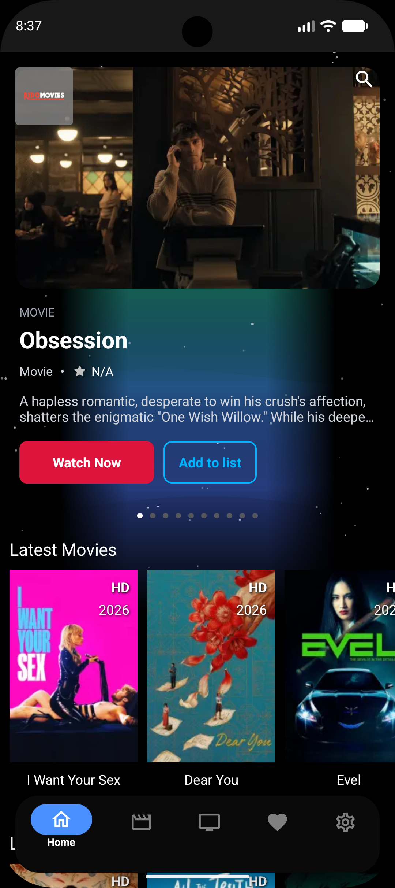
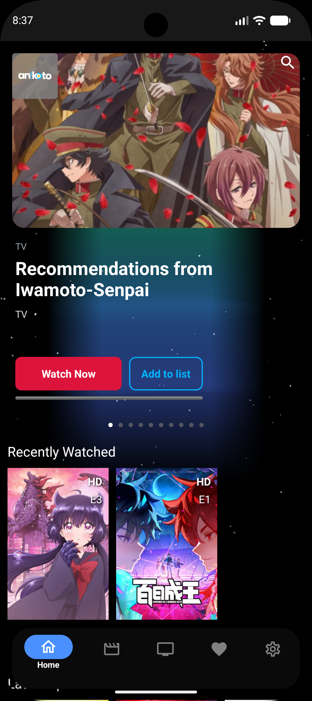
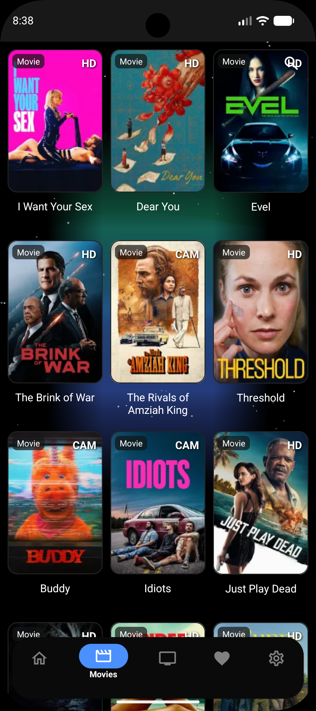
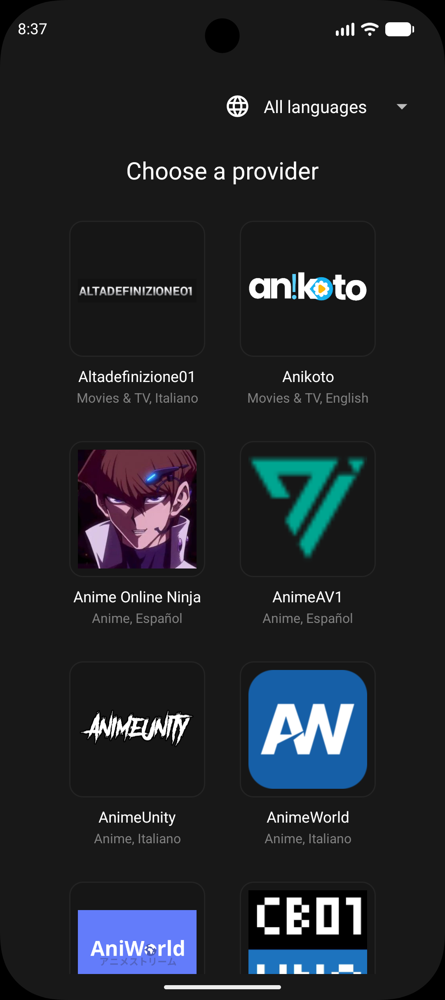
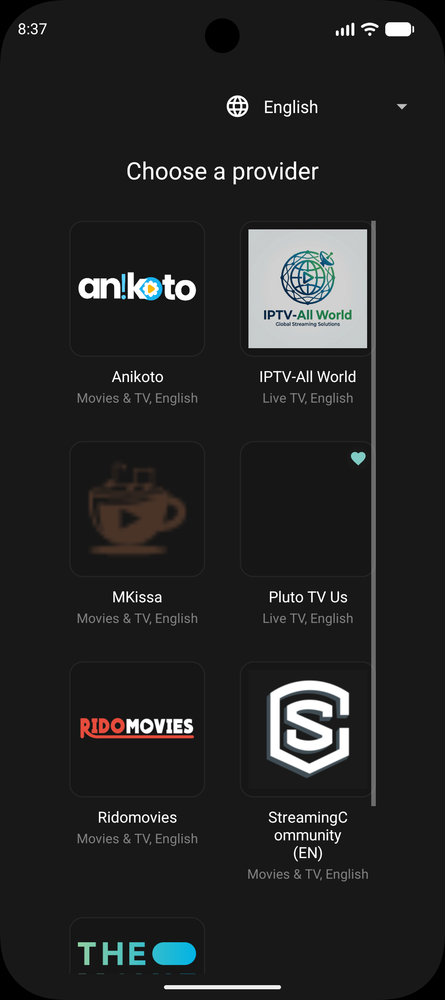
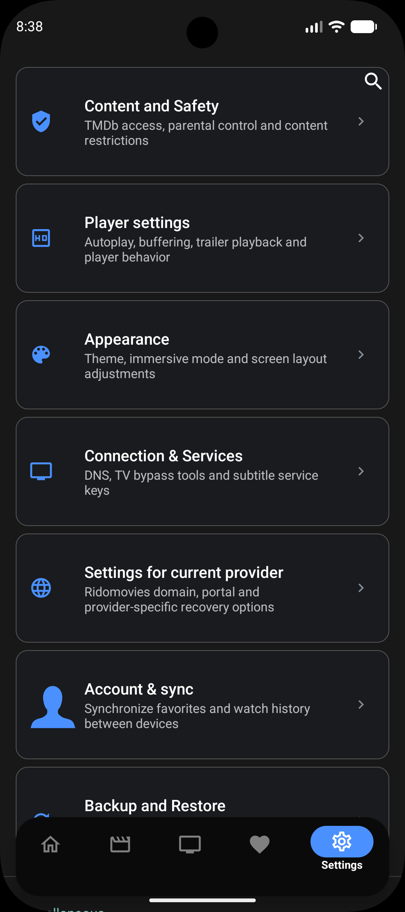

<h1 align="center">Zykflix</h1>

<p align="center">
  
  <br />
  <strong>🔄 Rebranded & Updated</strong> - A rebrand and updated version of the original Streamflix Reborn project, with a refreshed UI and cleanup of unused code
  <br />
  An open-source Android TV and mobile app for educational streaming interface, made with Android Studio, in Kotlin
  <br />
  <br />
  <strong>Version 1.0.0</strong>
  <br />
  <br />
  <a href="https://github.com/Zykrave/Zykflix/releases">
    <strong>Download app »</strong>
  </a>
  <br />
  <br />
  <a href="https://github.com/Zykrave/Zykflix/issues">Report Bug</a>
  ·
  <a href="https://github.com/Zykrave/Zykflix/issues">Request Feature</a>
</p>

> **Device recommendation:** The animated background effect (Aurora + Starfield) is a continuously-redrawn Canvas animation. For the smoothest experience, a device from 2019 or newer with at least 3GB RAM is recommended. On significantly older/lower-end hardware, this effect may cause minor frame drops while scrolling.

<details>
  <summary>Table of Contents</summary>

- [About the project](#about-the-project)
  - [What is Zykflix?](#-what-is-zykflix)
  - [Features](#features)
  - [Built with](#built-with)
- [Getting started](#getting-started)
  - [Prerequisites](#prerequisites)
  - [Setup](#setup)
- [Development](#development)
- [Contributing](#contributing)
- [Legal Disclaimer](#legal-disclaimer)
- [Credits & Authors](#credits--authors)
- [License](#license)
</details>

## About the project

<p align="center">
  
  
  
</p>
<p align="center">
  
  
  
</p>

**Zykflix** is an updated, rebranded continuation of the original Streamflix project created by [Lory-Stan TANASI](https://github.com/stantanasi) (and previously maintained as Streamflix Reborn). This project maintains the original educational purpose and functionality while introducing a refreshed UI, removal of unused/dead providers, and general modernization and cleanup.

### 🔄 What is Zykflix?

- **Updated & Modernized**: Refreshed UI and cleaned-up codebase with updated dependencies
- **Streamlined Providers**: Removed dead and unused providers, keeping only active and working sources
- **Independent Continuation**: Continuation of the original Streamflix and Streamflix Reborn projects
- **Respectful Fork**: Built with full respect for the original creator's work

Zykflix is an open-source Android TV and mobile app that provides a user interface for accessing publicly available streaming content from various third-party providers.

This app is designed for educational purposes and personal use only. Users are responsible for ensuring they have proper authorization to access any content they view through this application.

The interface aggregates content from multiple sources and provides a convenient way to browse available streaming options.

### Features

- Open-source and ad-free interface
- Aggregates content from multiple third-party providers
- No account required for the app interface
- Educational and personal use only
- Optimized UI & UX
- Multiple providers
- Resume from last playback position
- In-app update

### Built with

- [Android Studio](https://developer.android.com/studio)
- [Kotlin](https://kotlinlang.org)
- [Retrofit](https://square.github.io/retrofit)
- [ExoPlayer](https://exoplayer.dev)
- Leanback
- Coroutines
- MVVM Architecture
- Android Architecture Components


## Getting started

### Prerequisites

Install [Android Studio](https://developer.android.com/studio)

### Setup

1. Clone the project to your local machine

```bash
git clone https://github.com/Zykrave/Zykflix.git
```

2. Open the project in Android Studio

## Development

1. Select the device that you want to run the app

2. Click **Run**

## Contributing

Contributions are what make the open source community such an amazing place to learn, inspire, and create. Any contributions you make are **greatly appreciated**.

1. Fork the project
2. Create your feature branch (`git checkout -b feature/amazing-feature`)
3. Commit your changes (`git commit -m 'feat: add some amazing feature'`)
4. Push to the branch (`git push origin feature/amazing-feature`)
5. Open a pull request

## Legal Disclaimer

**IMPORTANT: This application is for educational and personal use only.**

- Zykflix does not host, store, or distribute any copyrighted content
- All content is sourced from third-party providers and websites
- Users are solely responsible for ensuring they have legal rights to access any content
- The developers do not endorse or encourage copyright infringement
- Users must comply with all applicable laws in their jurisdiction
- Any legal issues should be directed to the actual content providers
- This app functions as a search engine aggregator only
- No copyrighted material is stored on our servers

## Legal Notice

This application is provided "as is" for educational purposes. The developers:
- Do not claim ownership of any content
- Do not profit from copyrighted material
- Do not control third-party content providers
- Encourage users to support content creators through legal means
- Recommend using official streaming services when available

## Credits & Authors

### Original Creator
- **[Lory-Stan TANASI](https://github.com/stantanasi)** - Original Streamflix project creator

### Zykflix Development
- **[Zykrave](https://github.com/Zykrave)** - Zykflix maintainer
- **Special thanks** to the original creator for the excellent foundation

## License

This project is licensed under the `Apache-2.0` License - see the [LICENSE](LICENSE) file for details

### Original Project
<p align="center">
  <br />
  © 2022 Lory-Stan TANASI. All rights reserved
</p>

### Zykflix Project
<p align="center">
  <br />
  © 2026 Zykflix. Built with respect for the original work.
</p>
